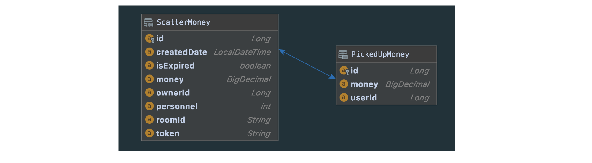

# money-scatter

## Introduction
- 사용자는 다수의 친구들이 있는 대화방에서 뿌릴 금액과 받아갈 대상의 숫자를 입력하여 뿌리기 요청을 보낼 수 있습니다.
- 요청 시 자신의 잔액이 감소되고 대화방에는 뿌리기 메세지가 발송됩니다.
- 대화방에 있는 다른 사용자들은 위에 발송된 메세지를 클릭하여 금액을 무작위로 받아가게 됩니다.

## 요구 사항
- 뿌리기, 받기, 조회 기능을 수행하는 REST API 를 구현합니다.
    - 요청한 사용자의 식별값은 숫자 형태이며 "X-USER-ID" 라는 HTTP Header로 전달됩니다.
    - 요청한 사용자가 속한 대화방의 식별값은 문자 형태이며 "X-ROOM-ID" 라는 HTTP Header로 전달됩니다.
    - 모든 사용자는 뿌리기에 충분한 잔액을 보유하고 있다고 가정하여 별도로 잔액에 관련된 체크는 하지 않습니다.
- 작성하신 어플리케이션이 다수의 서버에 다수의 인스턴스로 동작하더라도 기능에 문제가 없도록 설계되어야 합니다.
- 각 기능 및 제약사항에 대한 단위테스트를 반드시 작성합니다.
    
## 상세 구현 요건 및 제약 사항 
### 1. 뿌리기 API
- 뿌릴 금액, 뿌릴 인원을 요청값으로 받습니다.
- 뿌리기 요청건에 대한 고유 token을 발급하고 응답값으로 내려줍니다.
- 뿌릴 금액을 인원 수에 맞게 분배하여 저장합니다. (분배 로직은 자유롭게 구현해 주세요.)
- token은 3자리 문자열로 구성되며 예측이 불가능해야 합니다. 

### 2. 받기 API
- 뿌리기 시 발급된 token을 요청값으로 받습니다.
- token에 해당하는 뿌리기 건 중 아직 누구에게도 할당되지 않은 분배건 하나를 API를 호출한 사용자에게 할당하고, 그 금액을 응답값으로 내려줍니다.
- 뿌리기 당한 사용자는 한번만 받을 수 있습니다.
- 자신이 뿌리기한 건은 자신이 받을 수 없습니다.
- 뿌린기가 호출된 대화방과 동일한 대화방에 속한 사용자만이 받을 수 있습니다.
- 뿌린 건은 10분간만 유효합니다. 뿌린지 10분이 지난 요청에 대해서는 받기 실패 응답이 내려가야 합니다. 

### 3. 조회 API
- 뿌리기 시 발급된 token을 요청값으로 받습니다.
- token에 해당하는 뿌리기 건의 현재 상태를 응답값으로 내려줍니다. 현재 상태는 다음의 정보를 포함합니다.
- 뿌린 시각, 뿌린 금액, 받기 완료된 금액, 받기 완료된 정보([받은 금액, 받은 사용자 아이디] 리스트)
- 뿌린 사람 자신만 조회를 할 수 있습니다. 다른 사람의 뿌리기 건이나 유효하지 않은 token에 대해서는 조회 실패 응답이 내려가야 합니다.
- 뿌린 건에 대한 조회는 7일 동안 할 수 있습니다.

--- 

## Project Structure
#### Requirements
- > Gradle 5.6.4
- > Spring boot 2.3.1
- > H2 Database 1.4.200
- > JPA 2.3.1
- > Redis 2.3.1
- > Lombok 1.18.12
   
#### Package Structure
```bash
├── config
├── domain
│   ├── entity
│   └── repository
├── controller
│   └── dto
├── service
│   └── pojo
├── error
│   ├── advice
│   └── exception
├── interceptor
└── support
```

## API & Response
#### Rest API 
| Method | API | Parameter | Header | 기능 | 요약 |
|--|--|--|--|--|
| POST | /api/v1/money/scatter | money: long, personnel: int | "X-USER-ID": int, "X-ROOM-ID": String | 뿌리기 건 생성 후 고유 token 발급 | 뿌리기 API |
| PATCH | /api/v1/money/scatter | | "X-USER-ID", "X-ROOM-ID", "X-TOKEN-VALUE: String" | token 에 해당하는 뿌리기 건 중 랜덤 분배 금액 받기 | 받기 API |
| GET | /api/v1/money/scatter | | "X-USER-ID", "X-ROOM-ID", "X-TOKEN-VALUE": String | token에 해당하는 뿌리기 건의 현재 상태 조회 | 조회 API |

#### Exception Response
| Message | HttpState | Exception Class | 내용 |
|--|--|--|--|
| NO_REQUIRED_HEADER_INFO | 400 | NoRequiredHeaderException | 필수 헤더 정보 없음 |
| IS_NULL_VALUE | 400 | NullPointerException | null 입려값 |
| INVALID_INPUT_VALUE | 400 | InvalidValueException | 유효하지 않은 입려값 |
| CANNOT_RECEIVE_BECAUSE_OWNER | 400 | UnAuthorizationException | 뿌린 사람은 받을 수 없음 |
| REQUIRED_SAME_ROOM | 400 | UnAuthorizationException | 동일한 대화방 사용자만 받을 수 있음 |
| CANNOT_RECEIVE_BECAUSE_ALL_ALLOCATED | 400 | NotExistValueException | 뿌리기 돈이 모두 할당되어 받을 수 없음 |
| USER_IS_ALREADY_ALLOCATED | 400 | UnAuthorizationException | 뿌리기 당 한 번만 받을 수 있음 |
| EXPIRED_SCATTER_MONEY | 400 | NotExistValueException | 뿌리기 돈이 만료됨 (10분) |
| UN_AUTHORIZATION | 403 | UnAuthorizationException | 뿌리기 정보 조회 권한 없음 |
| NOT_EXIST_VALUE | 400 | NotExistValueException | 뿌리기 정보가 존재하지 않음 |
| EXPIRED_INQUIRY_PERIOD | 400 | NotExistValueException | 뿌리기 정보 조회 기간 만료됨 (7일) |
| -- | -- | -- | -- |

## DB ERD


#### ScatterMoney Table
- [pk] Long id: pk (auto increment)
- Long ownerId: 뿌린 사용자 id 
- String roomId: 뿌린 대화방 id 
- String token: 고유 토큰 
- int money: 뿌릴 금액 
- int personnel: 뿌릴 인원 
- LocalDateTime createDate: 뿌린 시각
- Boolean expired: 만료 여부 (7일)

#### PickedUpMoney Table
- [pk] Long id: pk (auto increment)
- [fk] Long scatter_id: 뿌리기 건 pk
- int money: 분배된 금액 
- int userId: 발급받은 사용자 id (같은 토큰 안에서 유일함) - nullable
   
## 요구 사항 문제 해결 전략
### 1. 뿌리기 API
- **request**
    - body: 뿌릴 금액, 뿌릴 인원 
    - header: 뿌린 사용자 "X-USER-ID", 뿌린 방 "X-ROOM-ID"
- **response**
    - token (예측 불가능한 3자리 문자열)
- 내부 구현 로직
    - [x] 뿌리기 요청 건을 생성한다.
        - [x] 고유한 token 발급 
            - 3자리 문자열 (예측 불가능)
            - token 생성 로직: 
        - [x] 요청한 사용자 식별값과 속한 대화방 정보 저장
            - 요청한 사용자의 식별값은 숫자 형태이며 "X-USER-ID" 라는 HTTP Header로 전달됩니다.
            - 요청한 사용자가 속한 대화방의 식별값은 문자 형태이며 "X-ROOM-ID" 라는 HTTP Header로 전달됩니다.
        - [x] 뿌린 시각, 뿌린 금액 저장 
    - 뿌릴 금액을 뿌릴 인원만큼 분배하여 저장한다. 
        - => **받기 API에서 처리**
        - 뿌리기 생성 시 분배하지 않고, 받기 API 요청 때 마다 분배하여 저장한다. 
    - [x] 생성한 token 을 응답값으로 보낸다.
    - [x] 해당 token 을 redis 의 key로 저장하고, 만료 시간(expireTime = 10분)을 설정한다.
        - redis client lib은 lettuce 사용 

### 2. 받기 API
- **request**
    - header: 뿌린 사용자 "X-USER-ID", 뿌린 방 "X-ROOM-ID", **토큰값 "X-TOKEN-VALUE"**
- **response**
    - token 에 해당하는 뿌리기 요청 건 중 할당받은 금액 
- 내부 구현 로직
    - [x] token에 해당하는 뿌리기 건 중 아직 누구에게도 할당되지 않은 분배건 하나를 API를 호출한 사용자에게 할당하고, 그 금액을 응답값으로 내려줍니다.
        - [x] 모든 분배 건이 할당되었으면 할당되었다고 응답한다.
        - [x] 할당받은 분배 건을 조회한 후, 분배 로직에 따라 금액을 정하여 insert 한다.
        - 분배 로직(더치페이): 금액을 인원 수로 나눈 몫을 기준으로 나누되, 소숫점이 남으면 마지막 금액에 모두 넣는다. 
            - e.g. 4777/3 = 1592 -> 2개, 4777-(1592*2) = 1593 -> 1개 
    - [x] 자신이 뿌리기한 건은 자신이 받을 수 없습니다.
        - 뿌린 사용자 id(ownerId)가 자신이면 받을 수 없다.
    - [x] 뿌리기 당한 사용자는 한번만 받을 수 있습니다.
        - 조회한 분배 건에 요청한 사용자 id가 있으면 받을 수 없다.
    - [x] 뿌리기가 호출된 대화방과 동일한 대화방에 속한 사용자만이 받을 수 있습니다.
        - 요청한 header 의 대화방 id 가 뿌리기 건의 대화방 id 가 같지 않으면 받을 수 없다.
    - [x] 뿌린 건은 10분간만 유효합니다. 뿌린지 10분이 지난 요청에 대해서는 받기 실패 응답이 내려가야 합니다. 
        - 뿌리기 건에 대한 받기 API 요청 시 해당 key 값이 redis에 없으면 만료 응답을 보낸다. 
        - redis client lib은 lettuce 사용 

### 3. 조회 API
- **request**
    - header: 뿌린 사용자 "X-USER-ID", 뿌린 방 "X-ROOM-ID", **토큰값 "X-TOKEN-VALUE"**
- **response**
    - token 에 해당하는 뿌리기 요청 건의 현재 상태 
- 내부 구현 로직
    - [x] token에 해당하는 뿌리기 건의 현재 상태를 응답값으로 내려줍니다. 
        - 뿌리기 건 API 호출 시 저장한 정보를 조회하여 반환한다. 
        - 뿌린 시각, 뿌린 금액, 받기 완료된 금액, 받기 완료된 정보([받은 금액, 받은 사용자 아이디] 리스트)
    - [x] 뿌린 사람 자신만 조회를 할 수 있습니다. 
        - [x] 다른 사람의 뿌리기 건에 대해서는 조회 실패 응답이 내려가야 합니다.
            - ownerId 에 해당하는 사용자만 조회할 수 있다. 
            - 뿌리기 건의 ownerId 와 header의 userId 를 비교한다.
        - [x] 유효하지 않은 token에 대해서는 조회 실패 응답이 내려가야 합니다.
            - 조회 시 데이터가 없으면 실패 응답을 반환한다.
    - [x] 뿌린 건에 대한 조회는 7일 동안 할 수 있습니다.
        - 방법 1) 조회 후 생성 시간이 7일 이전이면 조회할 수 없다는 응답 반환 (구현한 방법)
        - 방법 2) 배치 돌면서 만들어진 시간 이후 7일 지난 데이터는 expired = true 처리
